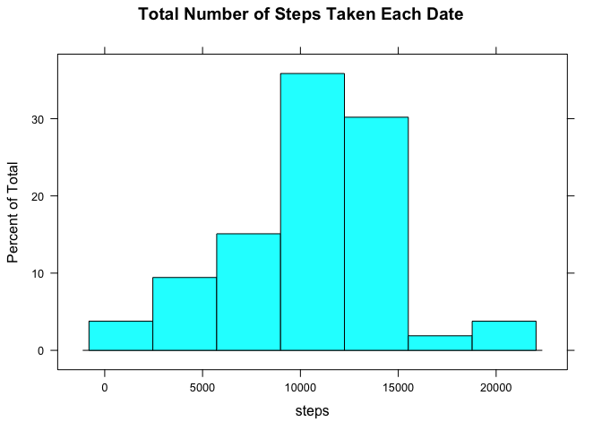
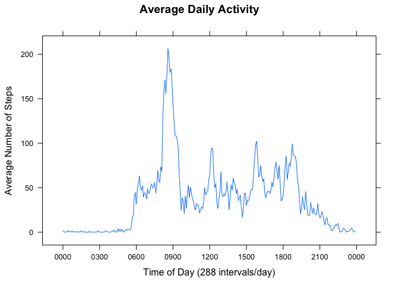
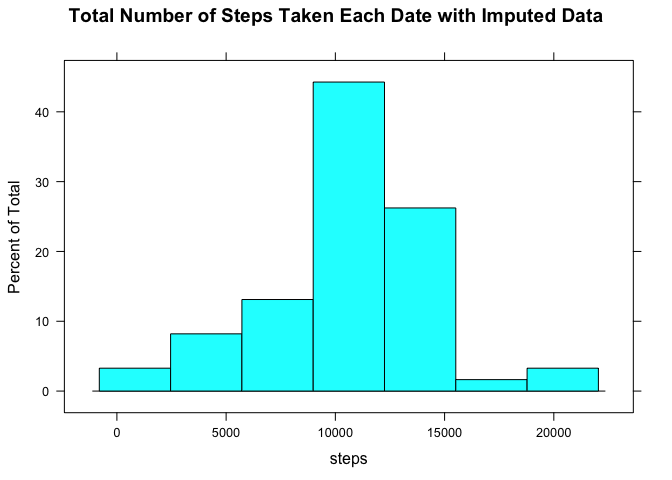
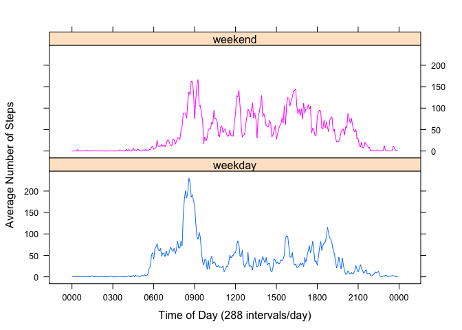

# Reproducible Research: Peer Assessment 1


## Loading and preprocessing the data

```r
# data file has been downloaded from https://d396qusza40orc.cloudfront.net/repdata%2Fdata%2Factivity.zip
# unzipped and placed in the working directory
# read the file
data <- read.csv("activity.csv", colClasses=c("numeric","Date","numeric"))
head(data)
```

```
##   steps       date interval
## 1    NA 2012-10-01        0
## 2    NA 2012-10-01        5
## 3    NA 2012-10-01       10
## 4    NA 2012-10-01       15
## 5    NA 2012-10-01       20
## 6    NA 2012-10-01       25
```

```r
tail(data)
```

```
##       steps       date interval
## 17563    NA 2012-11-30     2330
## 17564    NA 2012-11-30     2335
## 17565    NA 2012-11-30     2340
## 17566    NA 2012-11-30     2345
## 17567    NA 2012-11-30     2350
## 17568    NA 2012-11-30     2355
```

```r
dim(data)
```

```
## [1] 17568     3
```
The loaded data contains 17,568 observations of 3 variables
  
The interval column is **"Identifier for the 5-minute interval in which measurement was taken"**. It is a numeric class.
For accurate plotting it must be converted to the time field first.

```r
# format the interval to a format "0000-01-01 00:00". The actual values of year, month, 
# and date are not important but they are required in order to be converted to POSIXct class
ich <- sprintf("%s%02d:%02d", "0000-01-01 ",data$interval%/%100, data$interval%%100)
# convert to POSIX type
timeinterval <- strptime(ich, "%Y-%m-%d %H:%M")
# add an extra column "timeinterval" to the data frame
data <- cbind(data,timeinterval)
head(data)
```

```
##   steps       date interval        timeinterval
## 1    NA 2012-10-01        0 0000-01-01 00:00:00
## 2    NA 2012-10-01        5 0000-01-01 00:05:00
## 3    NA 2012-10-01       10 0000-01-01 00:10:00
## 4    NA 2012-10-01       15 0000-01-01 00:15:00
## 5    NA 2012-10-01       20 0000-01-01 00:20:00
## 6    NA 2012-10-01       25 0000-01-01 00:25:00
```
## What is mean total number of steps taken per day?

```r
# using aggregate function get total number of steps for each date
totalbydate <- aggregate(steps ~ date, data, sum)
head(totalbydate)
```

```
##         date steps
## 1 2012-10-02   126
## 2 2012-10-03 11352
## 3 2012-10-04 12116
## 4 2012-10-05 13294
## 5 2012-10-06 15420
## 6 2012-10-07 11015
```

```r
# load lattice library
library(lattice)
# plot a histogram of the total number of steps taken each day
histogram(~ steps, data=totalbydate, main="Total Number of Steps Taken Each Date")
```

 
    
The mean and median of total number of steps taken per day

```r
# calculate mean
totalbydate.mean <- mean(totalbydate$steps)
print(totalbydate.mean)
```

```
## [1] 10766.19
```

```r
# calculate median
totalbydate.median <- median(totalbydate$steps)
print(totalbydate.median)
```

```
## [1] 10765
```

## What is the average daily activity pattern?

```r
# using aggregate function calculate the average number of steps 
# taken for each 5-minute interval across all days
avgbyinterval <- aggregate(steps ~ timeinterval, data, mean)
head(avgbyinterval)
```

```
##          timeinterval     steps
## 1 0000-01-01 00:00:00 1.7169811
## 2 0000-01-01 00:05:00 0.3396226
## 3 0000-01-01 00:10:00 0.1320755
## 4 0000-01-01 00:15:00 0.1509434
## 5 0000-01-01 00:20:00 0.0754717
## 6 0000-01-01 00:25:00 2.0943396
```

```r
# create a time series plot of the 5-minute interval (x-axis) and the average number of steps taken,
# averaged across all days (y-axis)  
xyplot(steps ~ timeinterval, data = avgbyinterval, type="l", main="Average Daily Activity", xlab="Time of Day (288 intervals/day)",
       ylab="Average Number of Steps",scales=list(x=list(tick.number=10), format="%H%M"))
```

 
  
As we see from the plot there is a spike of activity around 9 AM. Now we find a precise 5-minute interval id.

Find which 5-minute interval, on average across all the days in the dataset, contains the maximum number of steps

```r
# using max function find an interval id with maximum number of steps
maxinterval <- as.numeric(format(with(avgbyinterval, timeinterval[steps == max(steps)]),"%H%M"))
print(maxinterval)
```

```
## [1] 835
```

## Imputing missing values
- Total number of rows with missing values

```r
nrow(data[is.na(data$steps),])
```

```
## [1] 2304
```
- Impute missing values. The strategy is to use a mean value of each interval calculated across all dates

```r
# make a copy of the original data with missing values
data.fixed  <- data
# replace the missing values (NA) in data.fixed frame with corresponding average number of steps
# from avgbyinterval data frame 
indx <- which(is.na(data.fixed$steps), arr.ind=TRUE)
for (i in indx){
    data.fixed$steps[i]  <- avgbyinterval$steps[avgbyinterval$timeinterval == data.fixed$timeinterval[i]]
}
head(data.fixed)
```

```
##       steps       date interval        timeinterval
## 1 1.7169811 2012-10-01        0 0000-01-01 00:00:00
## 2 0.3396226 2012-10-01        5 0000-01-01 00:05:00
## 3 0.1320755 2012-10-01       10 0000-01-01 00:10:00
## 4 0.1509434 2012-10-01       15 0000-01-01 00:15:00
## 5 0.0754717 2012-10-01       20 0000-01-01 00:20:00
## 6 2.0943396 2012-10-01       25 0000-01-01 00:25:00
```

```r
tail(data.fixed)
```

```
##           steps       date interval        timeinterval
## 17563 2.6037736 2012-11-30     2330 0000-01-01 23:30:00
## 17564 4.6981132 2012-11-30     2335 0000-01-01 23:35:00
## 17565 3.3018868 2012-11-30     2340 0000-01-01 23:40:00
## 17566 0.6415094 2012-11-30     2345 0000-01-01 23:45:00
## 17567 0.2264151 2012-11-30     2350 0000-01-01 23:50:00
## 17568 1.0754717 2012-11-30     2355 0000-01-01 23:55:00
```
- Look at the impact of imputing missing values

```r
# using aggregate function get total number of steps for each date in the fixed data
totalbydate.fixed <- aggregate(steps ~ date, data.fixed, sum)
# plot a histogram of the total number of steps taken each day in the fixed data
histogram(~ steps, data=totalbydate.fixed, main="Total Number of Steps Taken Each Date with Imputed Data")
```

 
  
The mean and median of total number of steps taken each day with the imputed data  

```r
# calculate mean of steps in the fixed dara
totalbydate.mean.fixed <- mean(totalbydate.fixed$steps)
print(totalbydate.mean.fixed)
```

```
## [1] 10766.19
```

```r
# calculate median of steps in the fixed data
totalbydate.median.fixed <- median(totalbydate.fixed$steps)
print(totalbydate.median.fixed)
```

```
## [1] 10766.19
```
  
Compare mean and median values before and after imputing the missing values

```r
sprintf("Mean values before %f and after %f imputing missing values", totalbydate.mean, totalbydate.mean.fixed)
```

```
## [1] "Mean values before 10766.188679 and after 10766.188679 imputing missing values"
```

```r
sprintf("Median values before %f and after %f imputing missing values", totalbydate.median, totalbydate.median.fixed)
```

```
## [1] "Median values before 10765.000000 and after 10766.188679 imputing missing values"
```
## Are there differences in activity patterns between weekdays and weekends?

```r
# create a factor vector with 2 levels "weekday", "weekend" based on the value of date column
# of data.fixed data frame
type <- factor( ifelse(weekdays(data.fixed$date) %in% c("Saturday","Sunday"), "weekend","weekday"))
# add a new column type to the data frame
data.fixed <- cbind(data.fixed, type)
head(data.fixed)
```

```
##       steps       date interval        timeinterval    type
## 1 1.7169811 2012-10-01        0 0000-01-01 00:00:00 weekday
## 2 0.3396226 2012-10-01        5 0000-01-01 00:05:00 weekday
## 3 0.1320755 2012-10-01       10 0000-01-01 00:10:00 weekday
## 4 0.1509434 2012-10-01       15 0000-01-01 00:15:00 weekday
## 5 0.0754717 2012-10-01       20 0000-01-01 00:20:00 weekday
## 6 2.0943396 2012-10-01       25 0000-01-01 00:25:00 weekday
```

```r
# create data frames with the average number of steps for each interval for weekdays and weekend activities
avgweekday <- aggregate(steps ~ timeinterval, data.fixed[type == 'weekday',], mean)
avgweekend <- aggregate(steps ~ timeinterval, data.fixed[type == 'weekend',], mean)
head(avgweekday)
```

```
##          timeinterval      steps
## 1 0000-01-01 00:00:00 2.25115304
## 2 0000-01-01 00:05:00 0.44528302
## 3 0000-01-01 00:10:00 0.17316562
## 4 0000-01-01 00:15:00 0.19790356
## 5 0000-01-01 00:20:00 0.09895178
## 6 0000-01-01 00:25:00 1.59035639
```

```r
head(avgweekend)
```

```
##          timeinterval       steps
## 1 0000-01-01 00:00:00 0.214622642
## 2 0000-01-01 00:05:00 0.042452830
## 3 0000-01-01 00:10:00 0.016509434
## 4 0000-01-01 00:15:00 0.018867925
## 5 0000-01-01 00:20:00 0.009433962
## 6 0000-01-01 00:25:00 3.511792453
```

```r
# create 2 panel time series plot for weekends and weekdays to view the differences 
xyplot(steps ~ timeinterval | which, make.groups(avgweekday,avgweekend), 
       groups=which, type="l", layout=c(1,2), ylab="Average Number of Steps", 
       xlab="Time of Day (288 intervals/day)",
       scales=list(x=list(tick.number=10), format="%H%M"),
       strip=strip.custom(factor.levels=c("weekday","weekend")))
```

 
  
From the plots we can see differences between weekdays and weekends activities. An addition to the regular
morning activities the Person is also more active during mid-day on weekends.
